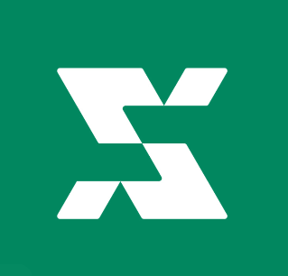

<p align="center">
  
</p>

<h1 align="center">Mobix — Platform Distribusi Aplikasi Android Komunitas</h1>

<p align="center">
  <strong>Pasang aplikasi Android komunitas dengan mudah. Publikasikan karyamu dengan harga termurah.</strong>
</p>

<p align="center">
  <a href="https://mobix-mu.vercel.app">mobix-mu.vercel.app</a> ·
  <a href="https://wa.me/6285933648537">Kontak Admin (WhatsApp)</a>
</p>

---

## 📱 Apa itu Mobix?

**Mobix** adalah platform distribusi aplikasi **Android** berbasis komunitas dari Indonesia. Kami menjembatani developer lokal dengan pengguna yang butuh aplikasi — baik itu **tools**, **game**, **utilitas**, atau **aplikasi kustom**.

Mobix hadir karena banyak aplikasi komunitas yang sulit ditemukan di Play Store resmi. Di sini, setiap aplikasi bisa diakses langsung oleh siapa saja tanpa biaya besar.

## ✨ Fitur Website

| Fitur | Keterangan |
|-------|-----------|
| 🏠 **Beranda** | Menampilkan aplikasi terbaru dengan tombol Load More |
| 🔍 **Pencarian** | Cari aplikasi berdasarkan nama atau deskripsi |
| 📂 **Kategori** | 11 kategori: Tools, Game, Multimedia, Pendidikan, dll |
| 📄 **Detail Aplikasi** | Halaman lengkap + tombol download langsung |
| 🔗 **Share & Embed** | Bagikan via WA/Telegram/Twitter + embed badge di website |
| 📊 **Developer Page** | Informasi cara publikasi + FAQ lengkap |
| 📱 **PWA Ready** | Bisa dipasang sebagai aplikasi di HP |

## 👨‍💻 Untuk Developer

Kamu membuat aplikasi Android dan ingin dipasang oleh banyak orang? **Mobix solusinya.**

Cukup 3 langkah:

1. **Chat WhatsApp** ke [085933648537](https://wa.me/6285933648537)
2. **Kirim data aplikasi** (nama, deskripsi, link APK/drive, icon)
3. **Bayar Rp10.000** via QRIS (sekali, seumur hidup aplikasi)

**Selesai.** Aplikasi langsung muncul di website dan bisa di-download siapa saja.

**Kenapa cuma Rp10.000?**
Karena Mobix bukan platform komersial — ini komunitas. Biaya ini hanya untuk operasional server dan proses unggah. Tidak ada potongan penjualan, tidak ada biaya bulanan. **Murah banget.**

### 🏅 Badge Developer

Setelah aplikasi terpasang, kamu bisa pasang badge Mobix di website-mu:

**HTML:**
```html
<a href="https://mobix-mu.vercel.app" target="_blank">
  
</a>
```

**Markdown:**
```markdown
[](https://mobix-mu.vercel.app)
```

**BBCode:**
```bbcode
[url=https://mobix-mu.vercel.app][img]https://mobix-mu.vercel.app/badge.svg[/img][/url]
```

## 🛠️ Tech Stack

- **Framework:** [Next.js](https://nextjs.org) (App Router)
- **Bahasa:** TypeScript
- **Styling:** Tailwind CSS
- **Font:** Geist by Vercel
- **Deploy:** Vercel
- **Data:** JSON statis (apps.json)

## 🚀 Menjalankan Lokal

```bash
git clone https://github.com/ardhikaxx/mobix.git
cd mobix
npm install
npm run dev
```

Buka [http://localhost:3000](http://localhost:3000).

### Build Produksi

```bash
npm run build
npm start
```

## 📄 Lisensi

Hak cipta milik masing-masing developer aplikasi. Kode website ini bersifat **open source** sebagai referensi pembelajaran komunitas.

---

<p align="center">
  <strong>Mobix — Dari komunitas, untuk komunitas.</strong><br>
  <a href="https://mobix-mu.vercel.app">mobix-mu.vercel.app</a>
</p>
